---
## Front matter
title: "Отчет по лабораторной работе №1"
subtitle: "Информационная безопасность"
author: "Софич Андрей Геннадьевич"

## Generic otions
lang: ru-RU
toc-title: "Содержание"

## Bibliography
bibliography: bib/cite.bib
csl: pandoc/csl/gost-r-7-0-5-2008-numeric.csl

## Pdf output format
toc: true # Table of contents
toc-depth: 2
lof: true # List of figures
lot: true # List of tables
fontsize: 12pt
linestretch: 1.5
papersize: a4
documentclass: scrreprt
## I18n polyglossia
polyglossia-lang:
  name: russian
  options:
	- spelling=modern
	- babelshorthands=true
polyglossia-otherlangs:
  name: english
## I18n babel
babel-lang: russian
babel-otherlangs: english
## Fonts
mainfont: IBM Plex Serif
romanfont: IBM Plex Serif
sansfont: IBM Plex Sans
monofont: IBM Plex Mono
mathfont: STIX Two Math
mainfontoptions: Ligatures=Common,Ligatures=TeX,Scale=0.94
romanfontoptions: Ligatures=Common,Ligatures=TeX,Scale=0.94
sansfontoptions: Ligatures=Common,Ligatures=TeX,Scale=MatchLowercase,Scale=0.94
monofontoptions: Scale=MatchLowercase,Scale=0.94,FakeStretch=0.9
mathfontoptions:
## Biblatex
biblatex: true
biblio-style: "gost-numeric"
biblatexoptions:
  - parentracker=true
  - backend=biber
  - hyperref=auto
  - language=auto
  - autolang=other*
  - citestyle=gost-numeric
## Pandoc-crossref LaTeX customization
figureTitle: "Рис."
tableTitle: "Таблица"
listingTitle: "Листинг"
lofTitle: "Список иллюстраций"
lolTitle: "Листинги"
## Misc options
indent: true
header-includes:
  - \usepackage{indentfirst}
  - \usepackage{float} # keep figures where there are in the text
  - \floatplacement{figure}{H} # keep figures where there are in the text
---

# Цель работы

Целью работы является умение установливать операционную систему на виртуальную машину а также минимально настраивать работу сервисов

# Задание

1. Установка и настрйока ОП	
2. Поиск информации с помощью команды dmesg ...

# Выполнение лабораторной работы

Скачиваю приложение виртуальной машины а также версию Linux Rocky,на которой буду работать в дальнейшем, создаю виртуальную машину, сначала задаю имя и операционную систему (рис. [-@fig:001]).

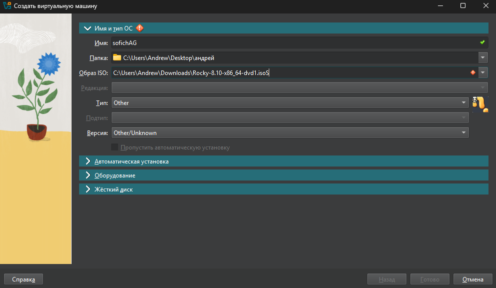{#fig:001 width=70%}

Выделяю на вирутальную машину оперативную память и процессоры (рис. [-@fig:002]).

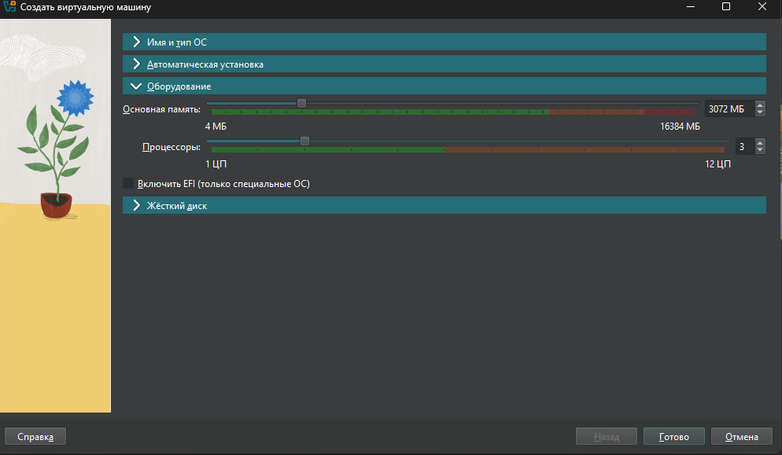{#fig:002 width=70%}

Выделяю на виртуальную машину внутреннюю память- 40 гб (рис. [-@fig:003]).

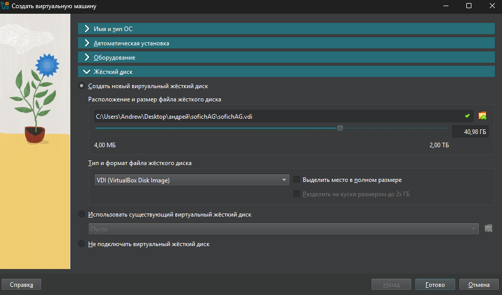{#fig:003 width=70%}

В носителях подключаю образ диска,после установки он сам пропадет (рис. [-@fig:004]).

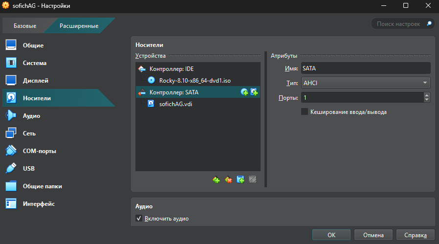{#fig:004 width=70%}

Запускаю виртуальную машину (рис. [-@fig:005]).

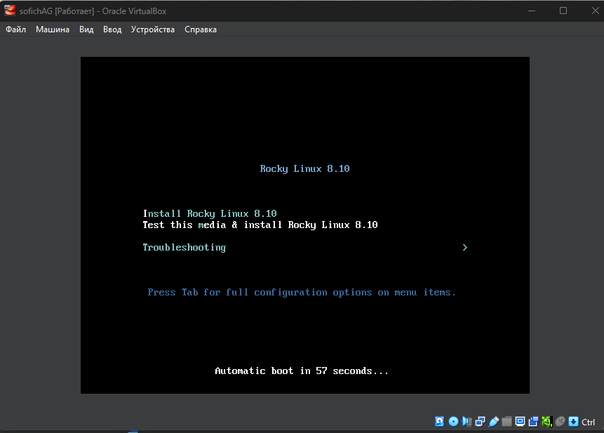{#fig:005 width=70%}

Начинаю настраивать систему, для начала выбираю язык (рис. [-@fig:006]).

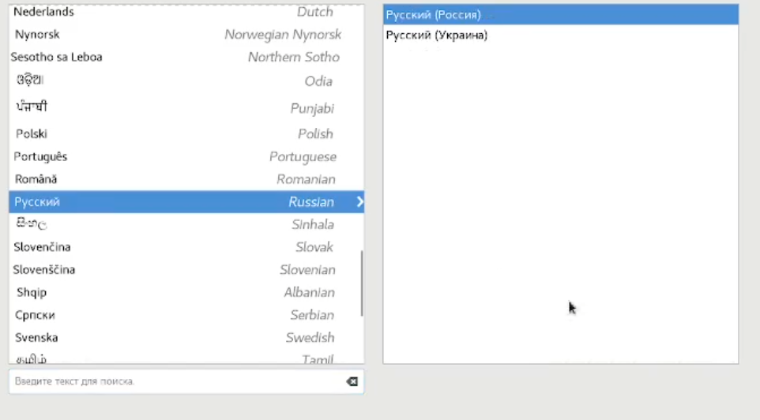{#fig:006 width=70%}

В соответствии с требованием лабораторной работы выбираю окружение сервер с GUB и средства разработки в дополнительном программном обеспечении (рис. [-@fig:007]).

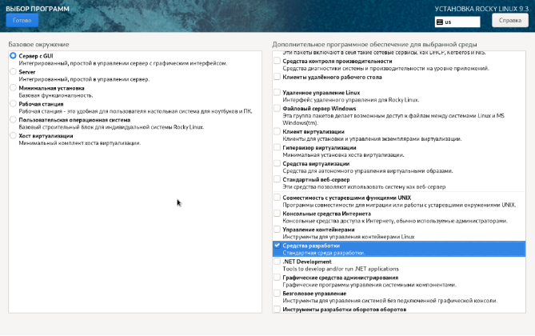{#fig:007 width=70%}

Отключаю kdump (рис. [-@fig:008]).

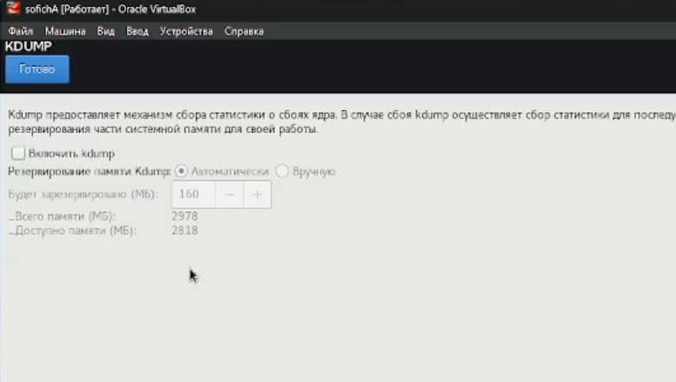{#fig:008 width=70%}

Указываю имя узла в соответствии с соглашением об именовании (рис. [-@fig:009]).

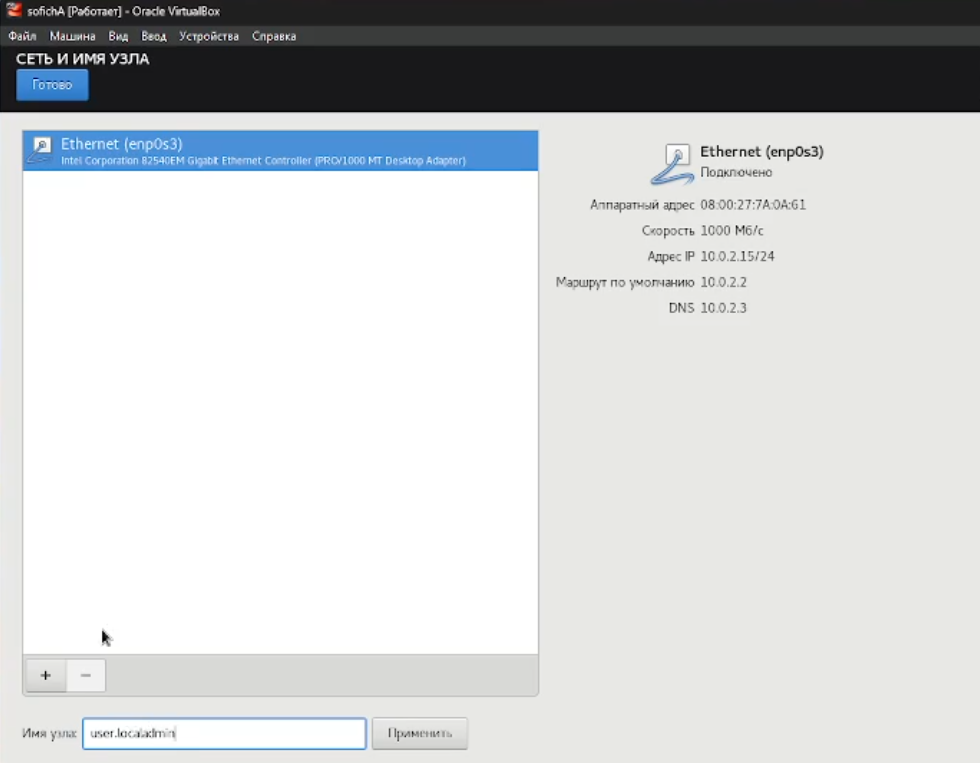{#fig:009 width=70%}

Создаю администратора и начинаю установку системы (рис. [-@fig:010]).

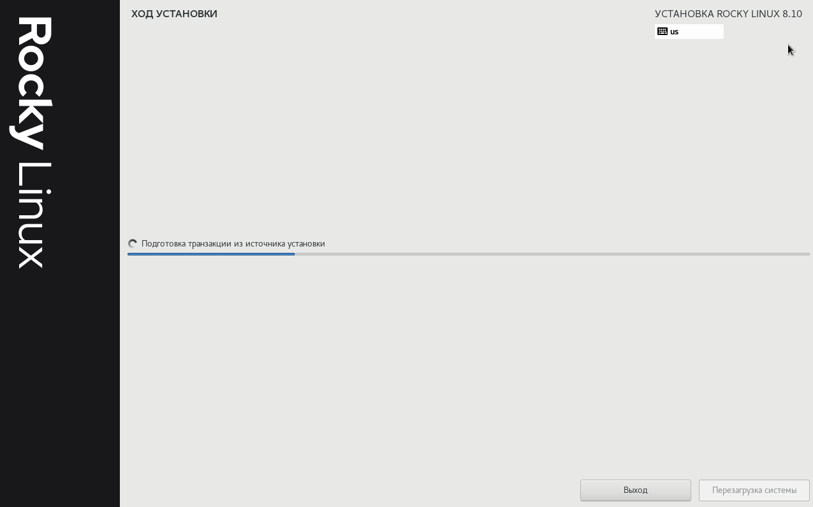{#fig:010 width=70%}

# Выполнение дополнительных заданий

Узнаю версию ядра- 4.18.0-553.el8_10.x86_64, частота процессора-3600.012 МГц, модель процессора-AMD Ryzen 5 3600,просматриваю доступную память (рис. [-@fig:011]).

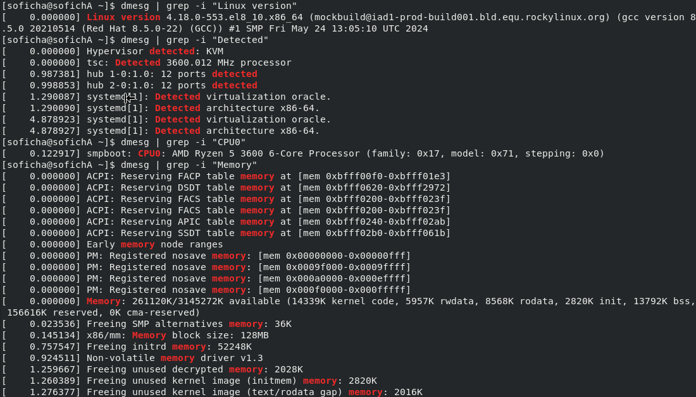{#fig:011 width=70%}

Обнаружен гипервизор типа KVM (рис. [-@fig:012]).

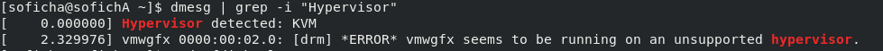{#fig:012 width=70%}

Команда sudo fdisk -l показывает тип файловой системы (рис. [-@fig:013]).

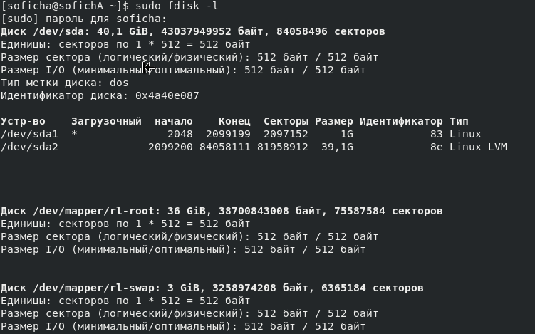{#fig:013 width=70%}

Далее показана последовательность монтирования файловых систем (рис. [-@fig:014]).

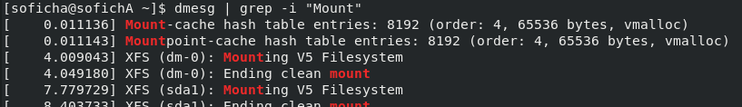{#fig:014 width=70%}

# Ответы на контрольные вопросы

1. Учетная запись содержит необходимые для идентификации пользователя при подключении к системе данные, а так же информацию для авторизации и учета: системного имени (user name) (оно может содержать только латинские буквы и знак нижнее подчеркивание, еще оно должно быть уникальным), идентификатор пользователя (UID) (уникальный идентификатор пользователя в системе, целое положительное число), идентификатор группы (CID) (группа, к к-рой относится пользователь. Она, как минимум, одна, по умолчанию - одна), полное имя (full name) (Могут быть ФИО), домашний каталог (home directory) (каталог, в к-рый попадает пользователь после входа в систему и в к-ром хранятся его данные), начальная оболочка (login shell) (командная оболочка, к-рая запускается при входе в систему).
2. Для получения справки по команде:  —help; для перемещения по файловой системе - cd; для просмотра содержимого каталога - ls; для определения объёма каталога - du ; для создания / удаления каталогов - mkdir/rmdir; для создания / удаления файлов - touch/rm; для задания определённых прав на файл / каталог - chmod; для просмотра истории команд - history
3. Файловая система - это порядок, определяющий способ организации и хранения и именования данных на различных носителях информации. Примеры: FAT32 представляет собой пространство, разделенное на три части: олна область для служебных структур, форма указателей в виде таблиц и зона для хранения самих файлов. ext3/ext4 - журналируемая файловая система, используемая в основном в ОС с ядром Linux.
4. С помощью команды df, введя ее в терминале. Это утилита, которая показывает список всех файловых систем по именам устройств, сообщает их размер и данные о памяти. Также посмотреть подмонтированные файловые системы можно с помощью утилиты mount.
5. Чтобы удалить зависший процесс, вначале мы должны узнать, какой у него id: используем команду ps. Далее в терминале вводим команду kill < id процесса >. Или можно использовать утилиту killall, что “убьет” все процессы, которые есть в данный момент, для этого не нужно знать id процесса.

# Выводы

Я приобрел навыки установки операционной системы.

# Список литературы{.unnumbered}

