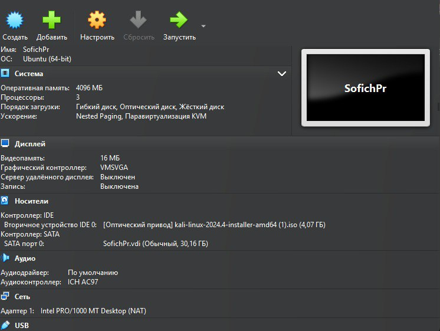
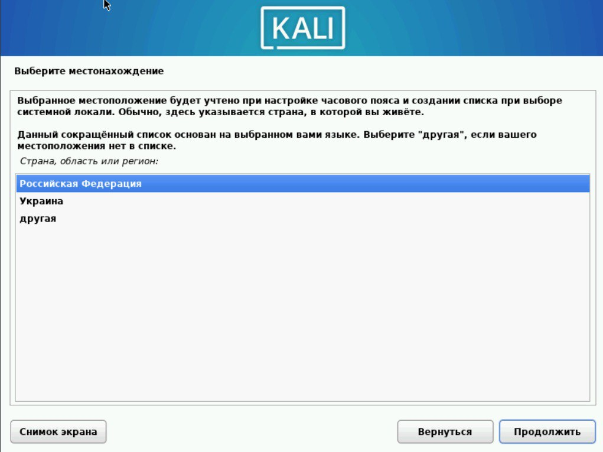
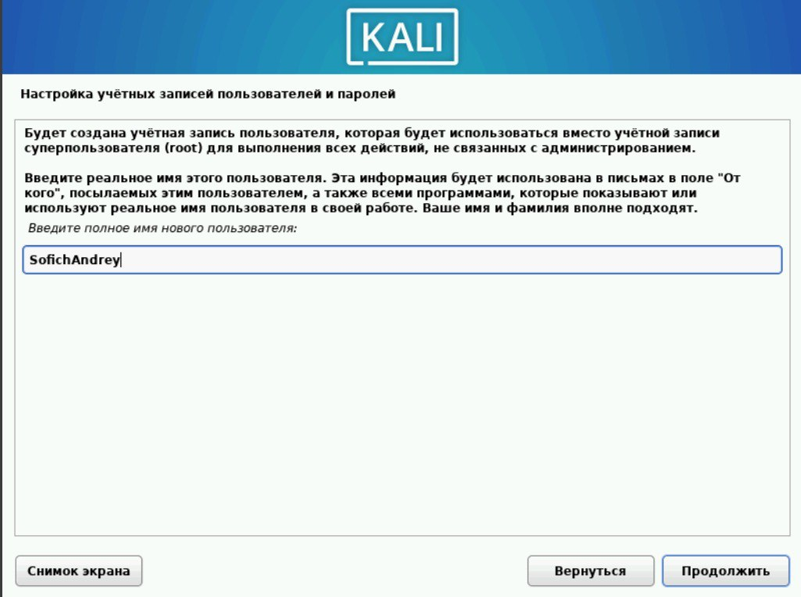
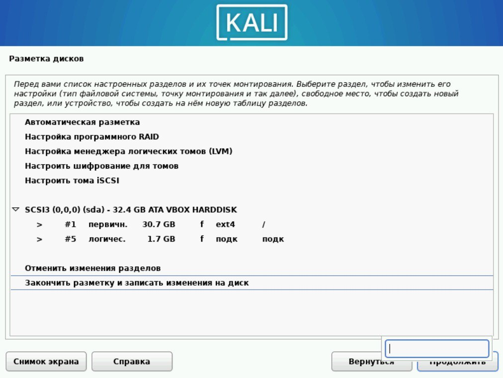
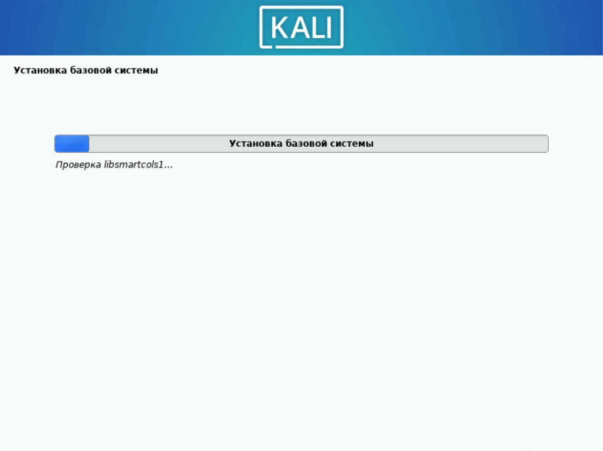
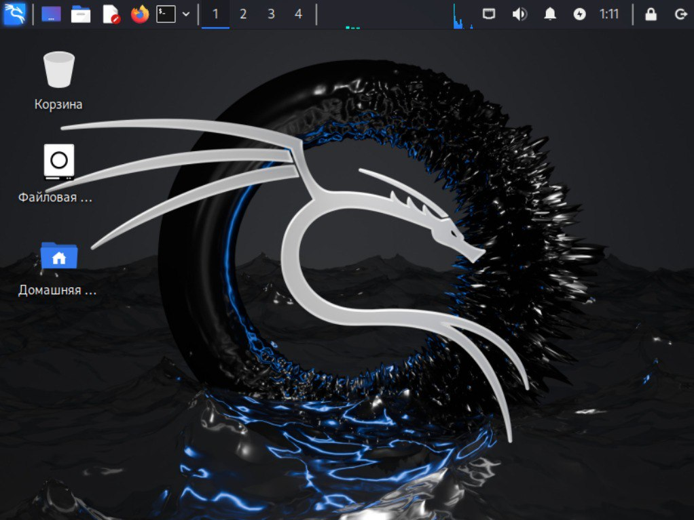

---
## Front matter
lang: ru-RU
title: Презентация по проекту №1
subtitle: Информационная безопасность			
author:
  - Софич А.С
institute:
  - Российский университет дружбы народов, Москва, Россия
  - НКАбд-04-23
date: 21 февраля 2025

## i18n babel
babel-lang: russian
babel-otherlangs: english

## Formatting pdf
toc: false
toc-title: Содержание
slide_level: 2
aspectratio: 169
section-titles: true
theme: metropolis
header-includes:
 - \metroset{progressbar=frametitle,sectionpage=progressbar,numbering=fraction}
 - '\makeatletter'
 - '\beamer@ignorenonframefalse'
 - '\makeatother'

## Fonts
mainfont: PT Serif
romanfont: PT Serif
sansfont: PT Sans
monofont: PT Mono
mainfontoptions: Ligatures=TeX
romanfontoptions: Ligatures=TeX
sansfontoptions: Ligatures=TeX,Scale=MatchLowercase
monofontoptions: Scale=MatchLowercase,Scale=0.9
---

## Докладчик

:::::::::::::: {.columns align=center}
::: {.column width="70%"}

  * Софич Андрей Геннадьевич
  * Студент
  * НКАбд-04-23
  * Российский университет дружбы народов
  * [1132237371@pfur.ru](mailto:1132237371@rudn.ru)

:::
::: {.column width="30%"}

:::
::::::::::::::

## Цели и задачи

Целью работы является умение установливать операционную систему Kali на виртуальную машину 

# Выполнение лабораторной работы

Скачиваю приложение виртуальной машины а также версию Linux Kali, ввожу имя машины, настраиваю количество видео памяти, оперативной памяти, внутренней памяти и кол-во процессоров.

Выбираю язык системы.

##

Указываю имя пользователя-логин.

##

Настраиваю диск,который будет привязан к системе .

##

Начинаю загрузку.

##

После перезагрузки запускаю систему.

## Выводы

Я приобрел навыки установки операционной системы.

